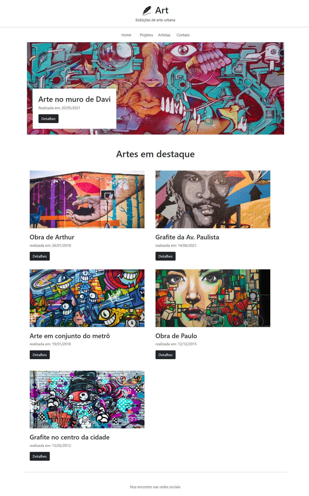

# Art: Exposição de Artes Urbanas

## Sobre o projeto.
Site responsivo de projetos artísticos. Galeria de grafite. A cidade mais viva e com alegria.

Data de conclusão: 30/11/2021

## Ferramentas e tecnologias usadas nesse projeto.
 
```js
function ArtUrbana(Project) {
    if (Front End) {
        const Stack = `${HTML}, ${CSS}`;
    } else (Framework) {
        const Stack = `${Bootstrap}`;
    }
};

```
<br>

<div align="center">



</div>

---

> - Autores: 
>   - [Eduardo Kayke](https://github.com/EduardoKayke "Perfil do Eduardo")

- [Voltar ao perfil do Github.](https://github.com/EduardoKayke "Perfil do Eduardo")

_Um dia seremos a tecnologia. Biohacking a própria evolução de nós mesmos._
